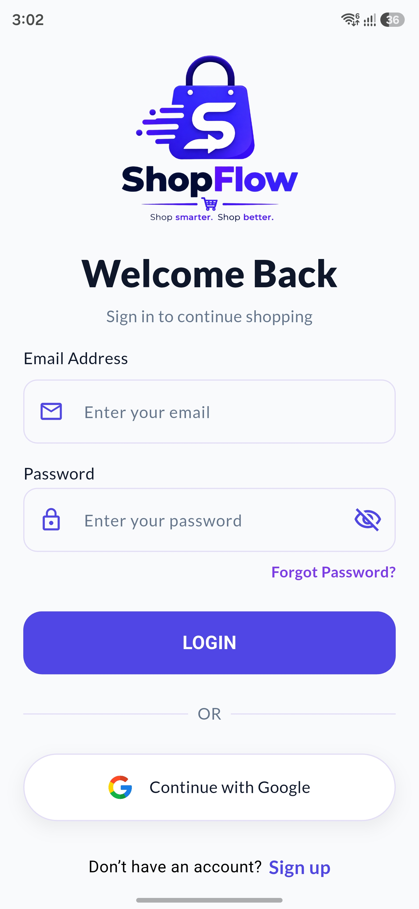
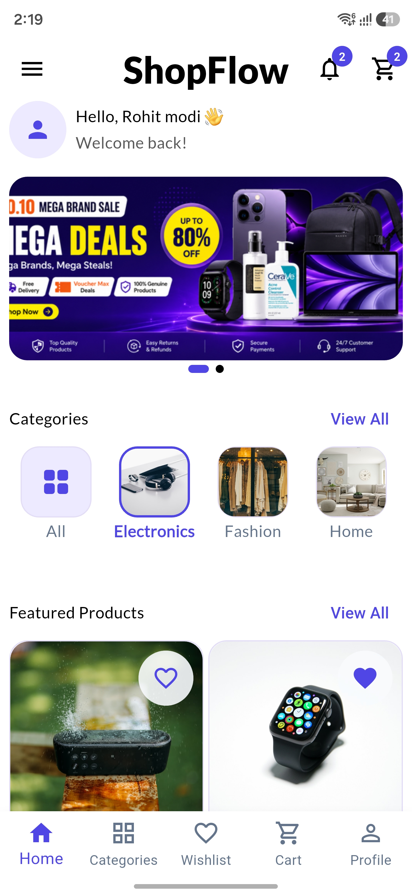
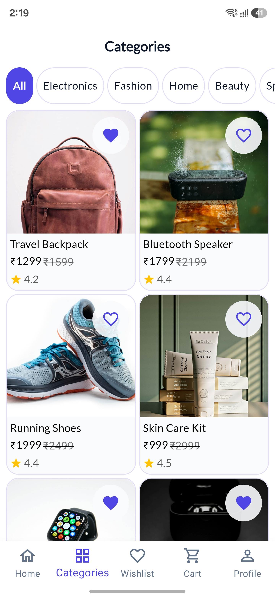
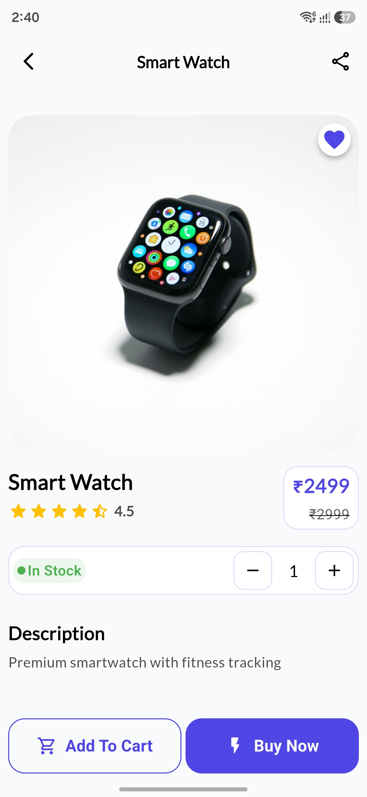
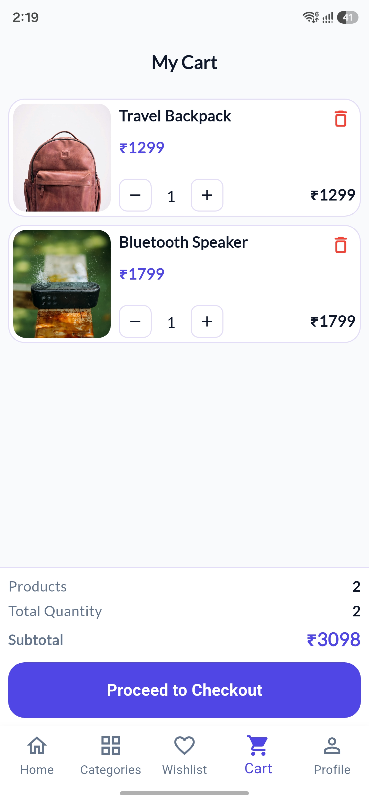
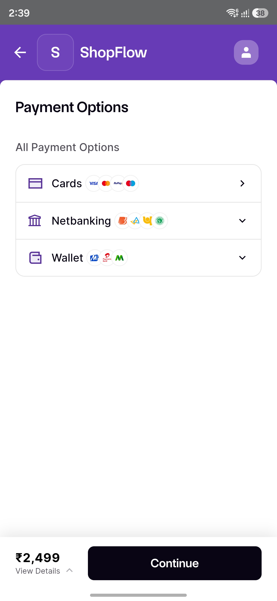
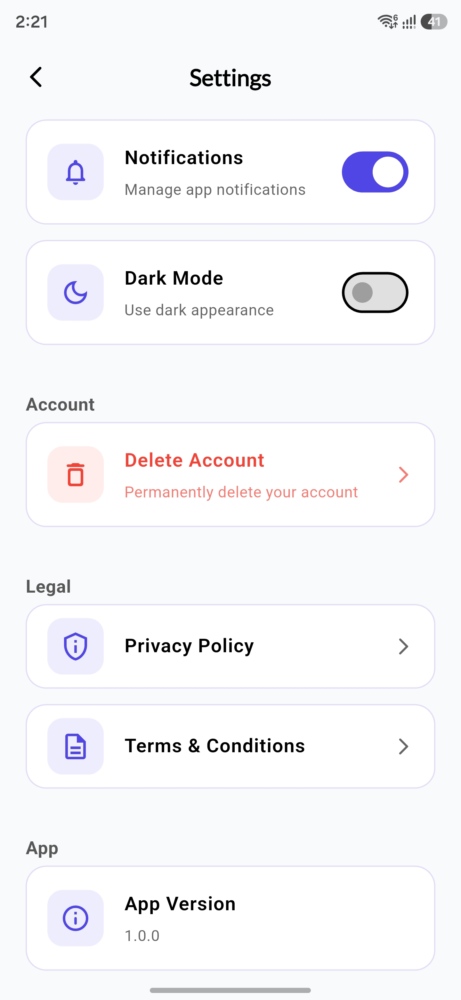

# 🛒 ShopFlow

ShopFlow is a Flutter-based e-commerce application developed for **Android and Web**.

The project demonstrates real-world Flutter development practices using **MVVM architecture, Provider, Firebase, Hive, Razorpay, automated testing, and CI/CD**.

## 🔗 Project Links

- 🌐 **Live Web Demo:** https://shopflow-1d1e1.web.app/
- 📱 **Android APK:** https://github.com/Rohitmodi1995/ShopFlow/releases/tag/v1.0.0
- 💻 **Source Code:** https://github.com/Rohitmodi1995/ShopFlow

## ✨ Features

### Authentication

- Email and Password Sign Up / Login
- Google Sign-In
- Email Verification
- Forgot Password
- Change Password
- Account Deletion

### Shopping

- Product Browsing
- Product Details
- Product Categories
- Wishlist
- Shopping Cart
- Buy Now
- Cart Checkout
- Address Management

### Payments & Orders

- Razorpay Payment Integration
- Order Placement
- Order Success Flow
- My Orders
- Order Details
- Order History

### Application

- Firebase Cloud Firestore
- Hive Local Storage
- Push Notifications
- Dark Mode
- Responsive UI for Android and Web
- Reusable UI Components

## 📱 App Screenshots

<p align="center">
  
  
  
</p>

<p align="center">
  
  
  
</p>

<p align="center">
  
</p>

## 🏗️ Architecture

ShopFlow follows **MVVM (Model-View-ViewModel)** with the **Repository Pattern**.

```text
UI / View
   ↓
ViewModel
   ↓
Repository
   ↓
Service
   ↓
Firebase / API / Local Storage